# Safecast System Architecture

This diagram shows the complete architecture of the Safecast radiation monitoring system, including both the MCP server and Map server deployments.

> **Note**: The mermaid source file is available at [architecture-diagram.mmd](architecture-diagram.mmd) for easy editing in mermaid diagram tools.

## Architecture Diagram

```mermaid
---
config:
  layout: elk
  theme: neutral
  look: neo
---
flowchart TB
 subgraph AI["🤖 AI Bots / Clients"]
        Claude["Claude.ai / Claude Code"]
        Other["Other MCP Clients"]
  end
 subgraph CDN["☁️ CloudFront CDN"]
        CF["simplemap.safecast.org\n(HTTP/HTTPS only)"]
        Assistant["assistant.safecast.org\n(web chat interface)"]
  end
 subgraph MCP["safecast-map-MCP (port 3333)"]
        MCPTools["16 MCP Tools\n(radiation, sensors, tracks, spectra)"]
        REST_MCP["REST API + Swagger\n/api/* /docs/"]
        DuckDB["DuckDB\n(tool usage analytics)"]
  end
 subgraph MapServer["safecast-new-map (port 8765)"]
        MapUI["Interactive Map UI"]
        REST_Map["REST API\n/api/tracks /api/stats /api/json/..."]
        Fetcher["bGeigie Auto-Sync\n(-safecast-fetcher)"]
        RTPoller["Real-time Sensor Poller\n(-safecast-realtime)"]
        SpectraUpload["Spectrum File Upload\n(SPE, N42, RCXML, RCTRK)"]
  end
 subgraph DB["🗄️ PostgreSQL + PostGIS"]
        markers["markers table\n(historical bGeigie data + spectrum locations)"]
        realtime["realtime_measurements\n(fixed sensors)"]
        spectra["spectra table\n(gamma spectroscopy channel data)"]
  end
 subgraph WebChat["Web Chat (port 3334)"]
        ChatUI["Chat Interface\n(HTML + JavaScript)"]
        ClaudeAPI["Claude API Client\n(Haiku 4.5)"]
  end
 subgraph Server["🖥️ simplemap.safecast.org (65.108.24.131)"]
        MCP
        MapServer
        WebChat
        DB
  end
 subgraph Devices["📡 Radiation Sensors"]
        bGeigie["bGeigie Nano/Zen\n(mobile survey)"]
        Fixed["Pointcast / Solarcast\n(fixed stations)"]
  end
 subgraph CICD["⚙️ GitHub Actions (CI/CD)"]
        GH_MCP["safecast-map-MCP\n→ cross-compile + deploy"]
        GH_Map["safecast-new-map\n→ cross-compile + deploy"]
  end
    MCPTools --> DuckDB
    MCPTools -- primary: localhost queries --> DB
    MapServer --> DB
    Fetcher -- "auto-sync approved imports" --> DB
    RTPoller -- poll live sensors --> realtime
    Claude -- "MCP protocol\n/mcp-http (streamable HTTP)\n/mcp/sse (SSE)" --> CF
    Other -- MCP protocol --> CF
    CF -- proxy → port 3333 --> MCP
    MCPTools -- fallback: REST API --> REST_Map
    Users["👥 Public Users"] -- HTTPS --> CF
    CF -- proxy → port 8765 --> MapUI
    WebUsers["💬 Web Chat Users"] -- HTTPS --> Assistant
    Assistant -- proxy → port 3334 --> ChatUI
    ClaudeAPI -- "localhost MCP calls" --> MCPTools
    bGeigie -- upload tracks --> REST_Map
    Fixed -- "real-time readings" --> RTPoller
    Spectrometers["📊 Gamma Spectrometers\n(bGeigieZen, RadiaCode, etc.)"] -- "upload spectrum files\n(SPE, N42, RCXML, RCTRK)" --> SpectraUpload
    SpectraUpload -- "parse & store" --> spectra
    SpectraUpload -- "store GPS location" --> markers
    GH_MCP -- rsync → IP direct --> Server
    GH_Map -- rsync → IP direct --> Server
```

## Key Components

### AI Clients & Users
- **Claude.ai / Claude Code**: Primary MCP client interface
- **Other MCP Clients**: Any application supporting the MCP protocol
- **Public Users**: Web browser access to the interactive map

### CloudFront CDN
- **simplemap.safecast.org**: Public-facing domain for map UI and MCP server
  - Provides HTTPS termination and caching
  - Proxies to port 8765 (Map UI) and port 3333 (MCP server)
- **assistant.safecast.org**: Web chat interface domain
  - Provides HTTPS termination
  - Proxies to port 3334 (Web Chat)

### MCP Server (port 3333)
- **16 MCP Tools**: Comprehensive radiation data query capabilities
  - **Historical data**:
    - `query_radiation` - Query radiation measurements by location and filters
    - `search_area` - Search measurements within a geographic area
    - `list_tracks` - List all bGeigie measurement tracks
    - `get_track` - Get detailed track information (includes `map_url` field)
    - `search_tracks_by_location` - Search tracks by geographic location and time filters (NEW)
    - `list_spectra` - List gamma spectroscopy measurements
    - `get_spectrum` - Get detailed spectrum data
  - **Real-time data**:
    - `list_sensors` - List all active fixed sensors
    - `sensor_current` - Get current readings from sensors
    - `sensor_history` - Historical data from fixed sensors
  - **Mixed**:
    - `device_history` - Supports both bGeigie and real-time sensors
  - **Analytics & Reference**:
    - `radiation_info` - Reference information about radiation units and safety
    - `radiation_stats` - Statistical analysis of radiation data
    - `top_uploaders` - Top data contributors (supports `group_by` parameter for flexible grouping)
    - `query_extreme_readings` - Find unusually high/low readings
    - `query_analytics` - MCP tool usage statistics (NOT Safecast upload stats)
    - `db_info` - Database metadata and table information
    - `ping` - Health check endpoint
- **REST API + Swagger**: HTTP API with OpenAPI documentation at /docs/
- **DuckDB Analytics**:
  - Logs all MCP tool invocations with timestamps, parameters, and results
  - Provides usage analytics via `query_analytics` tool
  - Enables performance monitoring and usage pattern analysis
  - Separate from PostgreSQL for optimized analytics workload

### Map Server (port 8765)
- **Interactive Map UI**: Web-based visualization of radiation data
- **REST API**: JSON endpoints for tracks, statistics, and map data
- **bGeigie Auto-Sync**: Automated fetcher for approved bGeigie track imports
- **Real-time Sensor Poller**: Polls fixed sensor stations for live readings
- **Spectrum File Upload**: Processes gamma spectroscopy data files
  - Supported formats: SPE (IAEA standard), N42 (ANSI), RCXML (RadiaCode XML), RCTRK (RadiaCode track)
  - Parses channel counts, energy calibration, live time, device info
  - Extracts GPS coordinates when available
  - Stores spectrum data in `spectra` table, location in `markers` table
  - Supports manual coordinate updates for files uploaded without GPS

### Web Chat Server (port 3334)
- **Chat Interface**: HTML/JavaScript conversational interface
- **Claude API Client**: Uses Claude Haiku 4.5 for optimal cost/performance
- **MCP Integration**: Connects to MCP server via localhost:3333
- **Public Access**: Available at assistant.safecast.org
- **Features**:
  - Natural language queries about radiation data
  - Interactive conversations with AI assistant
  - Real-time sensor data access via MCP tools
  - Historical track and measurement queries
  - Optimized system prompt (45% token reduction)

### PostgreSQL + PostGIS Database
- **markers table**:
  - Historical bGeigie mobile survey data (GPS tracks with radiation measurements)
  - Spectrum file GPS locations (links to spectra table via marker_id)
  - Each marker has lat/lon coordinates and timestamp
- **realtime_measurements**: Fixed sensor station readings (time-series data)
- **spectra table**:
  - Gamma spectroscopy channel data (energy spectrum histograms)
  - Includes channel counts, energy calibration coefficients
  - Device model, live time, measurement metadata
  - References marker_id for GPS location
  - Supports isotope identification and energy analysis
- **uploads table**: Tracks all file uploads (tracks and spectra) with source attribution
- Optimized with localhost connections for 60%+ query speedup

### Radiation Sensors & Devices
- **bGeigie Nano/Zen**: Mobile survey devices that upload GPS-tagged radiation measurements
  - Geiger counter-based dose rate logging
  - Creates tracks of measurements over time
- **Pointcast / Solarcast**: Fixed monitoring stations with real-time data feeds
  - Continuous monitoring at static locations
  - Data polled periodically by server
- **Gamma Spectrometers**:
  - bGeigieZen (with NaI or CsI detector)
  - RadiaCode 101/102/103 (CsI detector)
  - Other devices supporting SPE or N42 formats
  - Provides full energy spectrum for isotope identification
  - Files uploaded manually via web interface

### CI/CD Pipeline
- **GitHub Actions**: Automated cross-compilation and deployment
- Direct rsync deployment to server IP (bypassing CloudFront)
- Separate workflows for MCP server and Map server

## Data Flow

1. **Sensor Data Collection**
   - **bGeigie devices**: Upload tracks (LOG/CSV files) via REST API
   - **Fixed stations**: Polled periodically for real-time readings
   - **Gamma spectrometers**: Users upload spectrum files (SPE/N42/RCXML/RCTRK) via web UI

2. **Data Storage**
   - **Tracks**: Auto-sync fetcher imports approved tracks to markers table
   - **Real-time sensors**: Poller stores readings in realtime_measurements table
   - **Spectra**: Upload handler parses files and stores in:
     - `spectra` table: Channel data, calibration, metadata
     - `markers` table: GPS coordinates (when available)
     - `uploads` table: File tracking and attribution

3. **Data Access**
   - **MCP Clients** (Claude.ai, Claude Code, etc.): Query via MCP protocol (SSE or streamable HTTP)
   - **Web Users**: Access interactive map via `https://simplemap.safecast.org`
   - **Web Chat Users**: Access AI assistant via `https://assistant.safecast.org`
   - All database queries use localhost PostgreSQL connection for optimal performance

4. **Web Chat Flow**
   - User sends message to assistant.safecast.org
   - Web chat server receives request
   - Claude API processes message with MCP tool context
   - MCP tools query PostgreSQL database via localhost
   - Response formatted with clickable map links
   - User receives AI-generated answer with data

## Deployment

- **Server**: simplemap.safecast.org (65.108.24.131)
- **MCP Binary**: `/root/safecast-mcp-server/safecast-mcp`
- **Map Binary**: `/root/safecast-map-server/` (inferred location)
- **Web Chat Binary**: `/root/safecast-web-chat-server/safecast-web-chat`
- **Database**: PostgreSQL on localhost:5432
- **DuckDB**: Tool usage analytics database (file-based)
- **Deployment Method**: GitHub Actions → rsync over SSH using `setsid` to prevent SSH hangs
- **Health Checks**:
  - MCP: POST to `https://simplemap.safecast.org/mcp-http` with MCP initialize request
  - Web Chat: GET to `https://assistant.safecast.org/` (HTTP 200 expected)
- **Required Secrets**:
  - `SSH_PRIVATE_KEY`: For deployment authentication
  - `MAP_SERVER_HOST`: Server IP (65.108.24.131)
  - `ANTHROPIC_API_KEY`: For web chat Claude API access

## Recent Updates

### February 2026
- **search_tracks_by_location tool**: New MCP tool for searching radiation tracks by geographic location and time filters
- **map_url field**: Added to `get_track`, `list_tracks`, and `search_tracks_by_location` results with format `/trackid/{track_id}`
- **Web chat optimization**: Reduced system prompt token usage by 45% for more efficient AI interactions
- **top_uploaders enhancement**: Added `group_by` parameter for flexible grouping (by user_name, device_id, or custom fields)
- **DuckDB analytics**: Comprehensive tool usage logging and analytics system
- **Migration to simplemap.safecast.org**: Moved from vps-01.safecast.jp for 60%+ query speedup via localhost DB connections

## Spectrum File Processing

### Upload Flow
1. User uploads spectrum file via web interface (simplemap.safecast.org)
2. Upload handler receives file (SPE, N42, RCXML, or RCTRK format)
3. Format-specific parser extracts:
   - Channel counts (energy histogram)
   - Energy calibration coefficients (A + B×channel + C×channel²)
   - Live time and real time
   - Device model/detector type
   - GPS coordinates (if embedded in file)
   - Measurement timestamp
4. Data stored in database:
   - `spectra` table: Channel data, calibration, metadata
   - `markers` table: GPS location (creates new marker)
   - `uploads` table: Upload tracking record

### Supported Formats
- **SPE** (IAEA standard): Text-based format with channel data and metadata
- **N42** (ANSI N42.42): XML-based standard for radiation detectors
- **RCXML** (RadiaCode XML): RadiaCode-specific XML format
- **RCTRK** (RadiaCode Track): RadiaCode GPS-tagged spectrum track

### Data Structure
- **Spectrum**: Full energy histogram (typically 256-4096 channels)
- **Calibration**: Quadratic equation mapping channels to energy (keV)
- **Marker Reference**: Links spectrum to GPS coordinates via marker_id
- **Device Info**: Detector model extracted from file metadata

### Querying Spectra
- `list_spectra`: Browse/search spectrum metadata (without channel data)
- `get_spectrum`: Retrieve full channel data for specific spectrum
- Results include clickable map links to visualization

## Performance Optimizations

1. **Localhost Database Connections**: All PostgreSQL queries use localhost:5432 instead of remote connections
   - Eliminates network latency
   - Achieved 60%+ speedup in query performance

2. **DuckDB for Analytics**: Separate analytics database prevents PostgreSQL contention
   - Tool usage tracking doesn't impact main database performance
   - Fast analytical queries on usage patterns

3. **CloudFront CDN**:
   - HTTPS termination offloaded from application server
   - Static asset caching
   - Geographic distribution for global users

4. **Async Upload Processing**:
   - Files read into memory immediately
   - Processing happens asynchronously
   - Quick response to user (no waiting for parsing)
